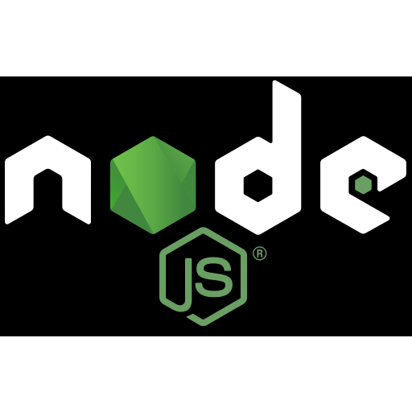

```{r setup, include = FALSE, eval = TRUE}
library(tidyverse)

pacman::p_load(dplyr, ggplot2, janitor, forcats,
               paletteer, prismatic, scales,xaringanthemer)
remotes::install_github("hadley/emo")
library(xaringan)

knitr::opts_chunk$set(eval = FALSE, tidy = FALSE)

```


```{r xaringan-themer, eval = TRUE, include=FALSE, warning=FALSE}
library(xaringanthemer)
style_mono_light(
  base_color = "#002633",
  text_color = darken_color("#E85A50", 0.5),
  white_color = lighten_color("#2b2d42", 0.95),
  code_inline_color = choose_dark_or_light("#edf2f4", "#edf2f4"),
  header_font_google = google_font("Chivo", "300", "700"),
  text_font_google   = google_font("Chivo", "300", "700"),
  code_font_google   = google_font("Fira Mono"),
  extra_css = list(".hljs-github .hjls" = list("background" = "black"),
                   ".small" = list("font-size" = "70%"),
                   ".small pre .remark-code" = list("font-size" = "75%"),
                   ".small .remark-code" = list("font-size" = "75%"),
                   ".tiny .remark-code" = list("font-size" = "50%"),
                   ".medium .remark-code" = list("font-size" = "90%")
  )
)
```

```{css, include = FALSE, eval = TRUE}
/* Extra CSS */
.hljs-github .hjls {
  font-size: 0.70em;
  background: black;
}
.small {
  font-size: 70%;
}
.small pre .remark-code {
  font-size: 75%;
}
.small .remark-code {
  font-size: 80%;
}
.tiny .remark-code {
  font-size: 60%;
}
.medium .remark-code {
  font-size: 90%;
}

```

  ## Overview

The topic of our conversation will be centered around how the SportsDataverse developer group is trying to build lasting solutions for accessing sports data and analytics. 

<a href='https://R.sportsdataverse.org/'></a>

**Slide Link**: [`slides.sportsdataverse.org/`](https://slides.sportsdataverse.org/)

---
### **The Goals**

* Creating open-source sports data resources for the community 
* Making the sports analytics industry more diverse, inclusive, and accessible

--

### **Some Solutions**

--

* Building an extensive set of open-source sports data repositories
--

* Create packages to access the data in Python, R, and Node.js
--

* Establish the bench of developers from diverse backgrounds to spearhead projects and make contributions
--

* Create new resources for women's sports to spur reproducible research. 

---

### First Things First

Saiem Gilani - Lead Engineer of the SportsDataverse<br><a href='https://twitter.com/saiemgilani' target='blank'></a> <a href='https://github.com/saiemgilani' target='blank'></a>

--

#### What I do

ML Engineer by trade, currently working for the Houston Rockets as the Director of Data Science & Engineering. 

--

#### How I got into open-source sports analytics

* Working as an analytics contributor with the folks at [TomahawkNation](https://www.tomahawknation.com/), the FSU SBNation site covering my hometown Seminoles

* Started contributing on my first open-source sports project, `cfbscrapR`, in early 2020

---

### The SportsDataverse Initiative `r emo::ji("light_bulb")` 

"...*the idea was to bring together a group of remarkable people, to see if they could become something more. To see if they could work together when we needed them to -- to scrape the data we never could.*"-
 
 .pull-right[~ *Nick FuRy* 
 <br>]
<br>
<br>
I had a thought I am sure many of the long-standing members of the sports analytics community has had.

  * *what if getting sports data for analysis was easy?*

  * *what if we worked together to build the data infrastructure for research?*
  
  * *how much further would we get?*
    
---

### What the SportsDataverse is:

* An organization trying to make the sports data and analytics industry more diverse, inclusive, and accessible by providing high-quality resources for end-users and opportunities for practical code skill development for those that join the effort  
   `r emo::ji("light_bulb")` + `r emo::ji("computer")` + `r emo::ji("chart_increasing")` 
   
--

* A community of developers committed to developing and maintaining open-source sports data packages and pipelines as on-going public utilities   
   `r emo::ji("group")` + `r emo::ji("speech_balloon")` + `r emo::ji("coder")` + `r emo::ji("package")`

--

* A set of packages for loading and scraping sports data in R, Python, and Node.js with focus placed on play-by-play data  
<a href="https://r.sportsdataverse.org/" target="_blank" alt="R">  </a>  + <a href="https://py.sportsdataverse.org" alt="Saiem's Python Packages" target="_blank">  </a> + <a href="https://js.sportsdataverse.org" target="_blank">  </a> 

--

* A set of corresponding data repositories which allow fast loading of the data for users and collectively form one of the largest open-source sports data resources with **over 250Gb of data produced** from the packages I contribute to   
   `r emo::ji("key")` + `r emo::ji("crown")`
   
---
### Function (naming) follows form

* Function names indicate the data source.
  - If the function starts with `load_`, `build_`, or `update_`, the data is coming from the data repository
  - Otherwise, it will be an abbreviation for the website supplying the data (i.e. `espn_`, `nba_`, `ncaa_`) for most other external functions

.split-left[
#### Common Scraper<br> Package Design
```{r apidatastore-draw, eval = TRUE, out.width = "47%", echo = FALSE}
knitr::include_graphics("https://raw.githubusercontent.com/saiemgilani/The_SportsDataverse_Initiative/main/figures/api-scraper.png")
```
<br>
]
.split-right[
#### SportsDataverse Package Design
```{r apiscraper-draw, eval = TRUE, out.width = "47%", echo = FALSE}
knitr::include_graphics("https://raw.githubusercontent.com/saiemgilani/The_SportsDataverse_Initiative/main/figures/api-datastore.png")
```
<br>
]
---
### Package Installation

Let's try out a few of the packages I have written for a quick walk-through of how the functions work.

We will be working with `cfbfastR`, `hoopR`, and `wehoop`, `fastRhockey` and `baseballr`. I prefer the `pacman` package for easy package loading and installation:
```{r cfbfastR_hoopR_wehoop_install, eval=FALSE, message=FALSE, warning=FALSE, echo = TRUE}

install.packages(c(
  'cfbfastR', 
  'hoopR', 
  'wehoop', 
  'fastRhockey', 
  'baseballr'),
  repos = c("https://cloud.r-project.org"))

```

---

## PBP Loading 
 - Season-level from data repo
 - Available for `cfbfastR`, `hoopR`, `wehoop`, `fastRhockey` (unavailable for `baseballr` at present)
 
### Load the Libraries
```{r load_libraries, eval=TRUE, echo=TRUE}
library(cfbfastR)
library(hoopR)
library(wehoop)
library(fastRhockey)
library(baseballr)
``` 
--
### College Football 

```{r cfbfastR_load_cfb, eval = TRUE, out.width = "40%", echo = TRUE}
cfb_pbp <- cfbfastR::load_cfb_pbp(2021)

```

### NFL
```{r nflverse_load_nfl}
# go use the nflverse, wyd
```

---
## Loading 
 - Season-level from data repo
   * Play-by-Play 
   * Team Boxscore
   * Player Boxscore
   
### Men's College Basketball
```{r hoopR_load_mbb, eval = TRUE, out.width = "40%", echo = TRUE}
mbb_pbp <- hoopR::load_mbb_pbp(2021)
mbb_team_box <- hoopR::load_mbb_team_box(2021)
mbb_player_box <- hoopR::load_mbb_player_box(2021)
```

### Women's College Basketball
```{r wehoop_load_wbb, eval = TRUE, out.width = "40%", echo = TRUE}
wbb_pbp <- wehoop::load_wbb_pbp(2021)
wbb_team_box <- wehoop::load_wbb_team_box(2021)
wbb_player_box <- wehoop::load_wbb_player_box(2021)
```

---
## Loading 
 - Season-level from data repo
   * Play-by-Play 
   * Team Boxscore
   * Player Boxscore
 
### NBA
```{r hoopR_load_nba, eval = TRUE, out.width = "40%", echo = TRUE}
nba_pbp <- hoopR::load_nba_pbp(2021)
nba_team_box <- hoopR::load_nba_team_box(2021)
nba_player_box <- hoopR::load_nba_player_box(2021)
```

### WNBA
```{r wehoop_load_wnba, eval = TRUE, out.width = "40%", echo = TRUE}
wnba_pbp <- wehoop::load_wnba_pbp(2021)
wnba_team_box <- wehoop::load_wnba_team_box(2021)
wnba_player_box <- wehoop::load_wnba_player_box(2021)
```

---
## Loading 
 - Season-level from data repo
   * Play-by-Play 
   * Team Boxscore
   * Player Boxscore
 
### NHL
```{r fastRhockey_load_nhl, eval = TRUE, out.width = "40%", echo = TRUE}
nhl_pbp <- fastRhockey::load_nhl_pbp(2021)
nhl_team_box <- fastRhockey::load_nhl_team_box(2021)
nhl_player_box <- fastRhockey::load_nhl_player_box(2021)
```

### PHF (Premier Hockey Federation)
```{r fastRhockey_load_phf, eval = TRUE, out.width = "40%", echo = TRUE}
phf_pbp <- fastRhockey::load_phf_pbp(2021)
phf_team_box <- fastRhockey::load_phf_team_box(2021)
phf_player_box <- fastRhockey::load_phf_player_box(2021)
```

---
## SportsDataverse Packages
### R <a href="https://r.sportsdataverse.org/" target="_blank" alt="R">  </a>

| **Package**  | **Sports Leagues**  | **Repository** | **Author(s)**  |
| :-- | :-- | :-- | :-- |
| cfbfastR | College Football | [GitHub][25] - [Docs][26] | Saiem Gilani, Akshay Easwaran, Jared Lee, Eric Hess |
| hoopR | NBA and Men’s College Basketball | [GitHub][1] - [Docs][2] | Saiem Gilani |
| wehoop | WNBA and Women’s College Basketball | [GitHub][3] - [Docs][4] | Saiem Gilani and Geoff Hutchinson |
| baseballr | MLB, MiLB, NCAA Baseball | [GitHub][9] - [Docs][10] | Bill Petti and Saiem Gilani |
| fastRhockey | Premier Hockey Federation | [GitHub][13] - [Docs][14] | Ben Howell and Saiem Gilani |
| worldfootballR | EPL, La Liga, Bundesliga, Serie A, Ligue 1, RFPL | [GitHub][7] - [Docs][8] | Jason Zivkovic |
| cfbplotR | College Sports visualizations | [GitHub][17] - [Docs][18] | Jared Lee |
| cfb4th | College Football Modeling  | [GitHub][19] - [Docs][20] | Jared Lee |
| gamezoneR | Men’s and Women’s College Basketball | [GitHub][5] - [Docs][6] | Jack Lichtenstein |
| puntr | NFL and College Football | [GitHub][21] - [Docs][22] | Dennis Brookner and Raphael LadenGuindon |
| recruitR | Men’s College Sports Recruiting | [GitHub][23] - [Docs][24] | Saiem Gilani and Ryan Mann |

  [25]: https://github.com/sportsdataverse/cfbfastR
  [26]: https://cfbfastR.sportsdataverse.org
  [1]: https://github.com/sportsdataverse/hoopR
  [2]: https://hoopR.sportsdataverse.org
  [3]: https://github.com/sportsdataverse/wehoop
  [4]: https://wehoop.sportsdataverse.org
  [5]: https://github.com/jacklich10/gamezoneR
  [6]: https://jacklich10.github.io/gamezoneR/
  [7]: https://github.com/JaseZiv/worldfootballR
  [8]: https://jaseziv.github.io/worldfootballR
  [9]: https://github.com/BillPetti/baseballr
  [10]: https://BillPetti.github.io/baseballr
  [13]: https://github.com/sportsdataverse/fastRhockey
  [14]: https://fastRhockey.sportsdataverse.org
  [17]: https://github.com/sportsdataverse/cfbplotR
  [18]: https://cfbplotR.sportsdataverse.org
  [19]: https://github.com/sportsdataverse/cfb4th
  [20]: https://cfb4th.sportsdataverse.org
  [21]: https://github.com/Puntalytics/puntr
  [22]: https://puntalytics.github.io/puntr/
  [23]: https://github.com/sportsdataverse/recruitR
  [24]: https://recruitR.sportsdataverse.org
  
---
### Thank you

* The seriously awesome community of developers that helps build and maintain resources 
* All y'all for listening in 

### Learn more

* [`sportsdataverse`.org](https://www.sportsdataverse.org/) 
<a href='https://twitter.com/sportsdataverse' target='blank'></a>

* [Game on Paper](https://gameonpaper.com/cfb/) - for a look at the `sportsdataverse` python package serving live advanced stats with expected points and win probability metrics.

<a href='https://twitter.com/saiemgilani' target='blank'></a> <a href='https://github.com/saiemgilani' target='blank'></a>

### Questions?